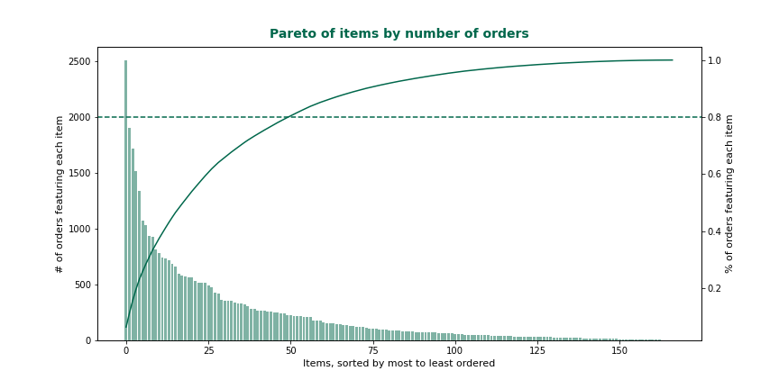

# You might also consider...

---------
### Problem Statement

This project is an exploration of recommendation engine methods applied to two public datasets from Kaggle:

- the [book recommendation dataset](https://www.kaggle.com/rashikrahmanpritom/groceries-dataset-for-market-basket-analysismba): content-based and collaborative filtering (see the book-recommender notebook),
- the [groceries dataset](https://www.kaggle.com/arashnic/book-recommendation-dataset): association rules-based recommendations (see the market-basket-recommender notebook).

----------------
### Possible Project Extensions

Given the opportunity, I plan on adding to the project by experimenting with:

1. different definitions of distance between users for the K-Means implementation (e.g. cosine or euclidean distance instead of hamming distance),
2. including in the market-basket-recommender also a section to deploy the association rules identified there to hypothetical baskets,
3. adding evaluation sections (e.g. using a leave-one-out approach) for all recommendation engine implementations in the project,
4. using the Python apriori library to build additional recommenders.
